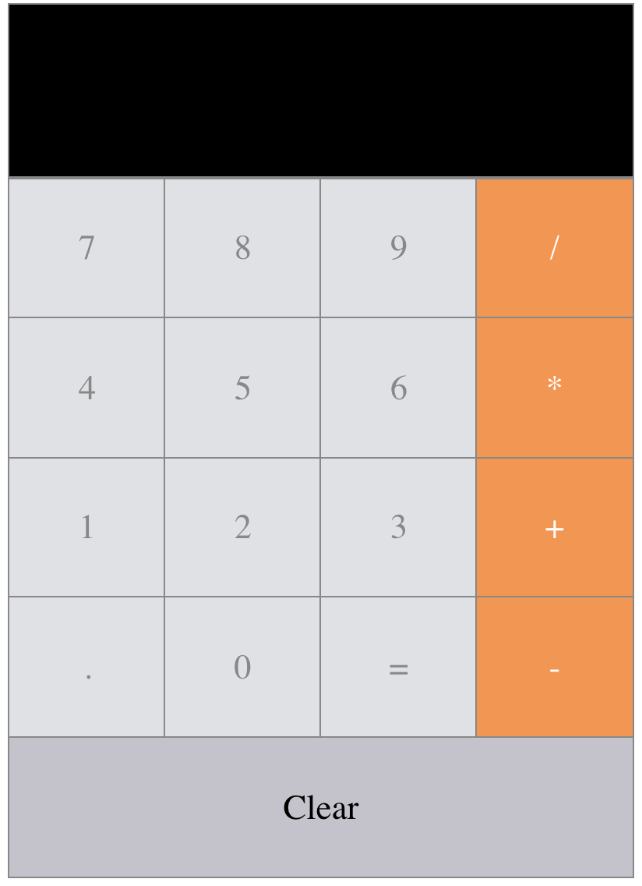

# React Calculator
> Web application that reminds you that 1+1 is 2.


React application built with MathJS. Allows user to put in an expression and returns the answ

<p align="center">
  
</p>

## Demo

> Demo of application can be found here: (http://vishshukla.github.io/react-calculator)


## Installation

```sh
git clone https://github.com/vishshukla/react-calculator.git

cd react-calculator

yarn install (or npm install)

yarn start (or npm start)

```

## Release History

* 0.1.0
    * The first proper release
    * Added basic functionallities (+,-,*,/)
* 0.0.1
    * Work in progress

## Author

Vishwas Shukla – [@vishshukla](https://www.linkedin.com/in/vishshukla/) 

## Contributing

1. Fork it (<https://github.com/yourname/yourproject/fork>)
2. Create your feature branch (`git checkout -b feature/fooBar`)
3. Commit your changes (`git commit -am 'Add some fooBar'`)
4. Push to the branch (`git push origin feature/fooBar`)
5. Create a new Pull Request
<!-- Link and img dfn's -->
[npm-image]: https://img.shields.io/npm/v/datadog-metrics.svg?style=flat-square
[npm-url]: https://npmjs.org/package/datadog-metrics